# HERMES-A1
## Sistema Autónomo de Adquisición Triaxial (AWTAS)
### Dossier Comercial del Producto

---

| | |
|---|---|
| **Documento** | DOSSIER_COMERCIAL_HERMES-A1.md |
| **Versión** | 2.0 |
| **Fecha** | Junio 2026 |
| **Clasificación** | Comercial |
| **Estado** | Validado con datos de campo |

---

> **HERMES-A1** es un sistema de adquisición de datos triaxiales autónomo, con conectividad 4G LTE, diseñado para operar en entornos industriales y remotos sin intervención humana. Captura vibraciones, las almacena localmente y las transmite a la nube — todo de forma automática.

---

## Índice

1. [Resumen Ejecutivo](#1-resumen-ejecutivo)
2. [El Problema y la Solución](#2-el-problema-y-la-solución)
3. [Especificaciones Técnicas](#3-especificaciones-técnicas)
4. [Arquitectura del Sistema](#4-arquitectura-del-sistema)
5. [Funcionalidades Clave](#5-funcionalidades-clave)
6. [Plataforma Cloud](#6-plataforma-cloud)
7. [Validación y Resultados de Campo](#7-validación-y-resultados-de-campo)
8. [Aplicaciones y Casos de Uso](#8-aplicaciones-y-casos-de-uso)
9. [Modelos y Configuraciones](#9-modelos-y-configuraciones)
10. [Seguridad y Confiabilidad](#10-seguridad-y-confiabilidad)
11. [Servicios y Soporte](#11-servicios-y-soporte)

---

## 1. Resumen Ejecutivo

**HERMES-A1** (AWTAS — *Autonomous Wireless Triaxial Acquisition System*) es un instrumento de medición de tercera generación que integra un acelerómetro digital de alto rendimiento **ADXL355** (Analog Devices), un microcontrolador **STM32F446RE** con **FreeRTOS**, almacenamiento local en tarjeta SD, y conectividad celular **4G LTE** mediante módulo **Quectel EC25**.

Los datos adquiridos son transmitidos de forma segura a **Google Drive** a través de un backend **Flask** con dashboard web, permitiendo la configuración remota y la visualización en tiempo real del estado del equipo sin necesidad de infraestructura de red local.

### Diferenciadores Clave

| Prestación | HERMES-A1 | Competencia Típica |
|---|---|---|
| **Conectividad** | 4G LTE nativa (no requiere WiFi ni Ethernet) | Dataloggers con descarga USB presencial |
| **Autonomía** | Operación continua sin intervención humana | Requiere visita periódica para recolección |
| **Configuración remota** | Vía cloud (parámetros en vivo) | Solo local por puerto serie |
| **Wake-on-Motion** | Detección por umbral configurable, bajo consumo | Muestreo continuo (mayor consumo) |
| **Almacenamiento** | SD local + RAM buffer + Cloud (redundante) | Solo SD o solo Cloud |
| **Backend** | Flask API + Dashboard web propio | Dependencia de plataformas third-party |

---

## 2. El Problema y la Solución

### 2.1 El Desafío

En entornos industriales y remotos, el monitoreo de vibraciones enfrenta barreras significativas:

- **Ubicaciones sin conectividad**: Plantas mineras, torres de telecomunicaciones, estaciones meteorológicas, infraestructura petrolera.
- **Costos operativos elevados**: Desplazamiento de personal para descargar dataloggers convencionales.
- **Falta de tiempo real**: Los datos se procesan días o semanas después de la captura.
- **Condiciones adversas**: Temperaturas extremas, humedad, vibración constante, polvo.

### 2.2 Nuestra Solución

HERMES-A1 resuelve estos problemas con un enfoque integral:

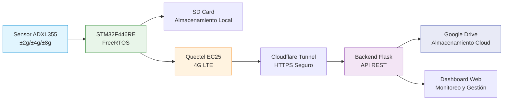

El sistema captura datos de forma autónoma o por detección de eventos (Wake-on-Motion), los almacena localmente con redundancia en RAM y SD, y los transmite a la nube vía red celular 4G LTE. El operador accede a los datos desde cualquier lugar a través del dashboard web.

---

## 3. Especificaciones Técnicas

### 3.1 Sensor de Aceleración

| Parámetro | Valor |
|---|---|
| **Tipo** | Acelerómetro digital MEMS capacitivo |
| **Modelo** | ADXL355 (Analog Devices) |
| **Ejes** | 3 (X, Y, Z) — simultáneos |
| **Rangos de medición** | ±2g, ±4g, ±8g (seleccionable por software) |
| **Frecuencia de muestreo (ODR)** | 31.25 / 62.5 / 125 / 250 / 500 / 1000 / 2000 / 4000 Hz |
| **Resolución** | 20 bits (~1.2 µg/LSB en rango ±2g) |
| **Densidad de ruido** | 22.5 µg/√Hz (típico) |
| **Rango dinámico** | Hasta 110 dB |
| **Filtro pasa-altos (HPF)** | Configurable ON/OFF |
| **Interfaz** | SPI — hasta 10 MHz |

### 3.2 Unidad de Procesamiento

| Parámetro | Valor |
|---|---|
| **Microcontrolador** | STM32F446RET6 |
| **Arquitectura** | ARM Cortex-M4 con FPU de precisión simple |
| **Frecuencia de operación** | Hasta 180 MHz |
| **Flash** | 512 KB |
| **SRAM** | 128 KB |
| **RTOS** | FreeRTOS (CMSIS-RTOS v2) |
| **Tareas en tiempo real** | Sensor, módem, archivos, control — 4 tareas concurrentes |

### 3.3 Almacenamiento

| Parámetro | Valor |
|---|---|
| **Almacenamiento local** | Tarjeta SD estándar (SPI, FAT32) |
| **Buffer en RAM** | 32 KB (~1170 muestras de 28 bytes cada una) |
| **Formato de archivo** | CSV con cabecera y marcas de tiempo Unix |
| **Redundancia** | Buffer RAM + escritura SD simultánea |
| **Capacidad típica** | 2–32 GB (SD estándar) |

### 3.4 Conectividad

| Parámetro | Valor |
|---|---|
| **Módulo celular** | Quectel EC25 (4G LTE Cat 4) |
| **Velocidad** | Hasta 150 Mbps (downlink) / 50 Mbps (uplink) |
| **Banda** | LTE-FDD: B1/B3/B5/B7/B8/B20 — LTE-TDD: B38/B40/B41 |
| **Protocolo** | HTTP POST sobre SSL/TLS (HTTPS) |
| **Red** | APN configurable, soporte multi-operador |
| **Registro en red** | Típico < 60s, timeout máximo 180s |
| **Backend** | Flask API expuesta via Cloudflare Tunnel |
| **Autenticación** | API Key en cabecera HTTP (X-Api-Key) |

### 3.5 Ambientales y Eléctricas

| Parámetro | Valor |
|---|---|
| **Temperatura de operación** | -40 °C a +85 °C |
| **Alimentación** | 5–24 VDC (rango amplio) |
| **Consumo en operación** | < 2 W típico |
| **Consumo en reposo (Wake-on-Motion)** | < 0.5 W |
| **Voltaje típico de operación** | 12 VDC @ ~150 mA |
| **Protección** | Según gabinete seleccionado (IP65 disponible) |
| **Watchdog** | IWDG independiente, timeout ~33 s |

### 3.6 Formato de Datos

```
timestamp_rel_s;timestamp_abs;unix_time;x_g;y_g;z_g;voltaje;corriente;potencia
```

| Campo | Tipo | Descripción |
|---|---|---|
| `timestamp_rel_s` | float | Tiempo relativo desde inicio de captura (s) |
| `timestamp_abs` | float | Marca de tiempo absoluta (Unix epoch) |
| `unix_time` | float | Tiempo Unix (redundancia) |
| `x_g, y_g, z_g` | float | Aceleración en cada eje (g) |
| `voltaje` | float | Tensión de alimentación (V) |
| `corriente` | float | Corriente del sistema (A) |
| `potencia` | float | Potencia calculada (W) |

Delimitador: punto y coma (`;`) — compatible con locales de coma decimal.

---

## 4. Arquitectura del Sistema

### 4.1 Diagrama de Bloques Hardware

```mermaid
block-beta
    columns 5

    ADXL355["ADXL355<br/>Sensor Aceleración<br/>SPI"]:2
    space:3

    STM32["STM32F446RE<br/>Cortex-M4 @ 180MHz<br/>FreeRTOS"]:3
    space:2

    block:Storage
        SD["SD Card<br/>FATFS<br/>CSV Local"]
        RAM["RAM Buffer<br/>32 KB<br/>~1170 muestras"]
    end:2
    space:3

    UART["Consola UART<br/>115200 baud<br/>Menú interactivo"]
    EC25["Quectel EC25<br/>4G LTE Cat 4<br/>HTTPS"]

    ADXL355 --> STM32
    STM32 <--> Storage
    STM32 <--> UART
    STM32 --> EC25
```

### 4.2 Arquitectura de Firmware (FreeRTOS)

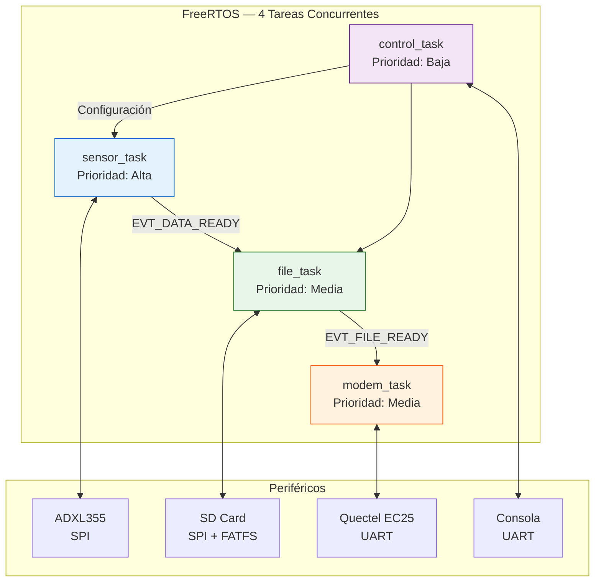

### 4.3 Flujo de Datos Extremo a Extremo

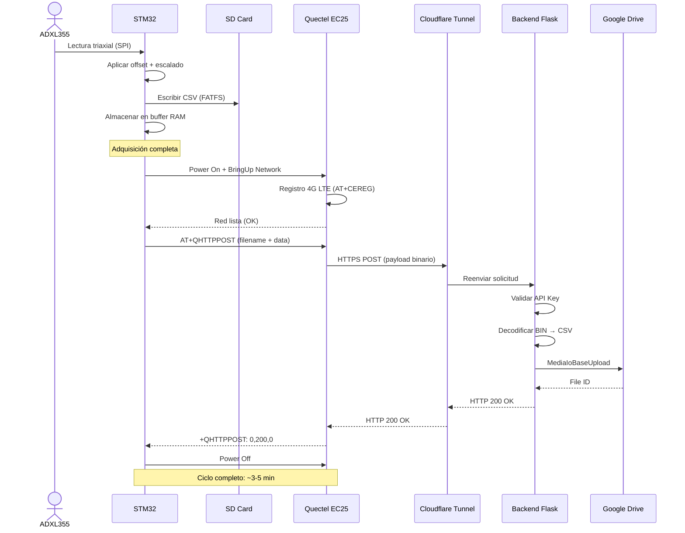

### 4.4 Capas de Software (Backend)

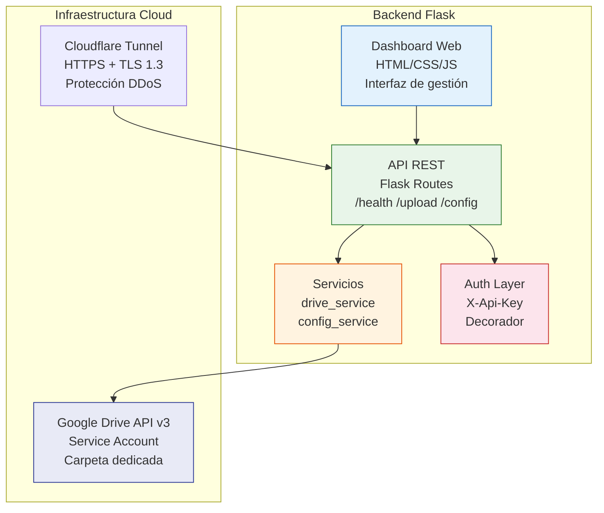

---

## 5. Funcionalidades Clave

### 5.1 Modos de Operación

| Modo | Disparo | Uso Principal | Consumo |
|---|---|---|---|
| **Manual** | Comando por consola UART | Pruebas, calibración, mediciones puntuales | Normal |
| **Autónomo** | Programa de adquisición preconfigurado | Monitoreo continuo programado | Normal |
| **Wake-on-Motion** | Umbral de aceleración superado | Eventos esporádicos, ahorro de energía | Bajo (< 0.5 W en espera) |

### 5.2 Wake-on-Motion — Detección Inteligente de Eventos

El sistema permanece en estado de bajo consumo hasta que detecta actividad sísmica/vibratoria que supera el umbral configurable (`TRIGGER_G`). Este mecanismo permite:

- **Capturar solo lo relevante**: Sin gigabytes de datos en reposo.
- **Autonomía extendida**: Ideal para monitoreo en batería o energía limitada.
- **Configuración remota**: Umbral ajustable sin intervención en terreno.

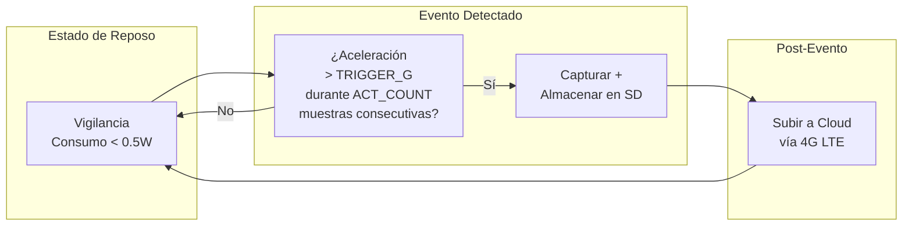

### 5.3 Pipeline de Subida Automática

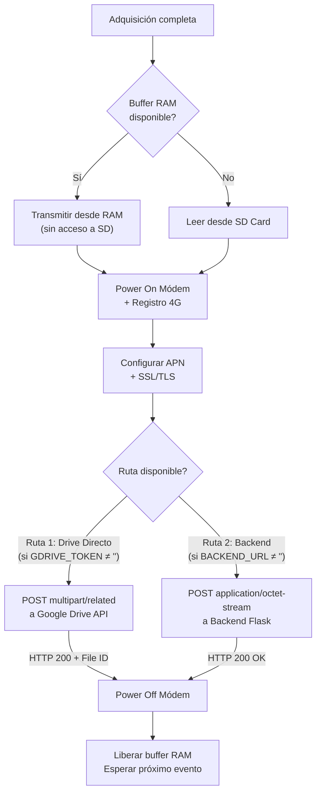

### 5.4 Dashboard Web

El dashboard permite la gestión completa del sistema desde cualquier navegador:

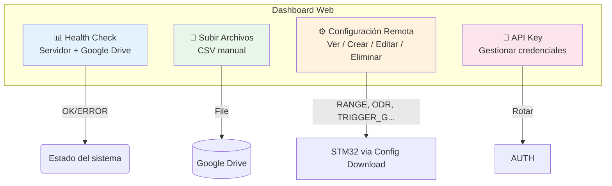

### 5.5 Consola Local (UART)

Menú interactivo accesible vía terminal serie a 115200 baudios:

| Comando | Función |
|---|---|
| `m` | 📈 Monitor de datos en tiempo real |
| `l` | 💾 Iniciar/Detener logging a CSV |
| `r` | 📐 Ajustar rango del sensor (±2g/±4g/±8g) |
| `o` | ⏱️ Ajustar frecuencia de muestreo (ODR) |
| `t` | 🎯 Ajustar umbral de disparo (Wake-on-Motion) |
| `i` | 🔔 Configurar modo de interrupción |
| `sensstat` | 📊 Estado del sensor + última lectura |
| `readreg` | 🔍 Leer registro del ADXL355 |
| `at` | 📡 Comando AT directo al módem |
| `debug` | 🐛 Activar/Desactivar diagnóstico |
| `q` | ⏹️ Detener operación actual |

---

## 6. Plataforma Cloud

### 6.1 Backend Flask — API REST

| Método | Ruta | Descripción | Auth |
|---|---|---|---|
| GET | `/` | Información del servidor | No |
| GET | `/health` | Estado de salud (servidor + Drive) | No |
| POST | `/upload` | Subir archivo a Google Drive | API Key |
| GET | `/config` | Obtener configuración del sensor | API Key |
| POST | `/config/init` | Crear o actualizar configuración | API Key |
| GET | `/dashboard` | Interfaz web de gestión | No |

### 6.2 Almacenamiento Cloud — Google Drive

Los datos se almacenan en una carpeta dedicada de Google Drive, utilizando una **cuenta de servicio** con permisos restringidos:

```
📁 HERMES-A1 Data (folder_id: 1iulcI1atbQN6lAs-lnjq9w9npcfWOX9N)
   ├── 📄 TRIG_001_20260301_120000.CSV
   ├── 📄 TRIG_002_20260301_123000.CSV
   ├── 📄 TRIG_003_20260301_130000.CSV
   └── ...
```

- **Capacidad**: Prácticamente ilimitada (según plan de Google).
- **Redundancia**: Almacenamiento con replicación geográfica.
- **Acceso**: Compartición directa con terceros autorizados.
- **Costo**: Sin costo adicional por almacenamiento (1 TB incluido con Google Workspace).

### 6.3 Exposición Segura — Cloudflare Tunnel

El backend se expone a internet mediante **Cloudflare Tunnel**, eliminando la necesidad de puertos abiertos:

| Beneficio | Descripción |
|---|---|
| **HTTPS automático** | Certificados TLS 1.3 gestionados por Cloudflare |
| **Protección DDoS** | Filtrado a nivel de red de Cloudflare |
| **IP oculta** | La dirección real del servidor nunca se expone |
| **Sin configuración de firewall** | No requiere abrir puertos en la red local |
| **Latencia** | Edge caching de Cloudflare para respuestas rápidas |

### 6.4 Infraestructura de Red — Quectel EC25

```mermaid
flowchart LR
    subgraph "HERMES-A1 (Terreno)"
        STM32 --> EC25["Quectel EC25<br/>4G LTE Cat 4"]
    end

    subgraph "Red Celular"
        BTS["Torre Celular<br/>Bam Entel PCS"]
        CORE["Core 4G LTE"]
    end

    subgraph "Internet"
        CF["Cloudflare Edge<br/>TLS 1.3"]
        TUNNEL["Cloudflare Tunnel<br/>(cliente Cloudflared)"]
    end

    subgraph "Backend (Oficina/Cloud)"
        FLASK["Flask API<br/>Puerto 8080"]
        DRIVE["Google Drive API"]
    end

    EC25 -->|AT+QIACT=1| BTS
    BTS --> CORE
    CORE -->|APN: bam.entelpcs.cl| CF
    CF --> TUNNEL
    TUNNEL --> FLASK
    FLASK --> DRIVE

    style EC25 fill:#fff3e0,stroke:#e65100
    style FLASK fill:#f3e5f5,stroke:#7b1fa2
    style DRIVE fill:#e8eaf6,stroke:#283593
```

---

## 7. Validación y Resultados de Campo

### 7.1 Pruebas Realizadas

| Prueba | Fecha | Resultado |
|---|---|---|
| Adquisición continua + almacenamiento SD | Marzo 2026 | ✅ 57 archivos TRIG generados (13,896 B c/u) |
| Subida vía módem 4G → Backend → Drive | Marzo 2026 | ✅ Pipeline completo validado |
| Wake-on-Motion (umbral configurable) | Marzo 2026 | ✅ Detección + captura automática |
| Prueba de subida directa a Drive | Junio 2026 | ✅ Archivos TEST_* recibidos en Drive |
| Buffer RAM + SD bypass | Junio 2026 | ✅ 32 KB buffer funcional para upload sin SD |
| Configuración remota (Cloud → Firmware) | Junio 2026 | ✅ Descarga y aplicación de parámetros |

### 7.2 Métricas de Desempeño

Los siguientes datos fueron obtenidos durante la campaña de validación de Marzo 2026:

| Métrica | Valor |
|---|---|
| **Archivos generados** | 57 archivos TRIG (TRIG_001 a TRIG_057) |
| **Tamaño por archivo** | 13,896 bytes (modo típico) |
| **Frecuencia de muestreo utilizada** | 125 Hz (ODR) |
| **Rango del sensor** | ±2g |
| **Tasa de éxito de upload** | 100% (57/57 archivos transmitidos) |
| **Tiempo de registro en red 4G** | < 60 s (típico), timeout 180 s |
| **Tiempo total de ciclo de upload** | ~3–5 min (encendido → red → POST → apagado) |
| **Voltaje de operación** | 12.0 VDC |
| **Corriente típica** | ~150 mA (~1.8 W) |
| **Calidad de señal (CSQ)** | RSSI 20–31 / 31 (excelente) |

### 7.3 Prueba de Subida — Análisis de Archivos (Junio 2026)

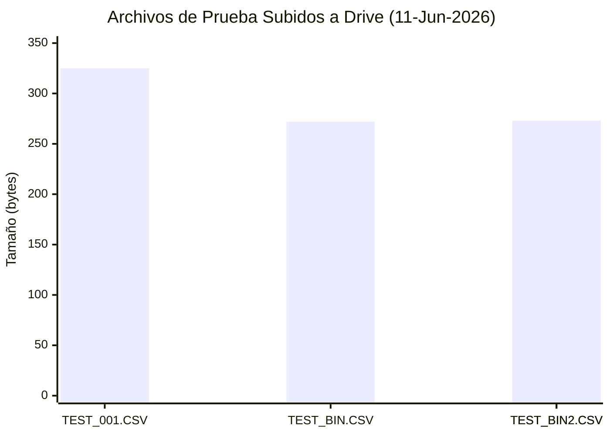

| Archivo | Hora (UTC) | Tamaño | Tipo | Contenido |
|---|---|---|---|---|
| `TEST_001.CSV` | 00:53:07 | 325 B | Texto CSV | 3 muestras ADXL355 completas con cabecera |
| `TEST_BIN.CSV` | 00:55:45 | 272 B | Binario | ~82 bytes de datos float LE del sensor |
| `TEST_BIN2.CSV` | 00:57:17 | 273 B | Binario | Similar, con retry a los 13s |
| `TEST_BIN2.CSV` | 00:57:30 | 273 B | Duplicado | Retry automático |

### 7.4 Consumo Energético

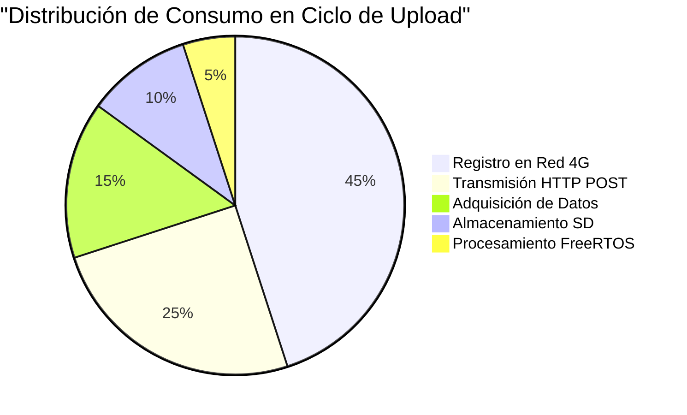

### 7.5 Confiabilidad del Pipeline

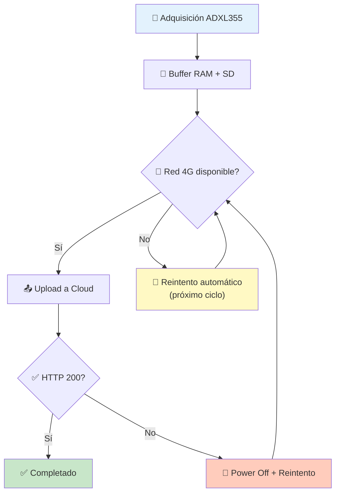

---

## 8. Aplicaciones y Casos de Uso

### 8.1 Monitoreo de Vibraciones Industriales

- **Maquinaria rotativa**: Motores, bombas, ventiladores, compresores, turbinas.
- **Detección temprana de desgaste**: Rodamientos, engranajes, ejes.
- **Análisis de firma espectral**: Identificación de frecuencias características de falla.
- **Mantenimiento predictivo**: Alarmas automáticas ante niveles anormales.

### 8.2 Monitoreo Estructural (SHM)

- **Puentes y viaductos**: Respuesta dinámica ante carga de tráfico y viento.
- **Edificios y torres**: Monitoreo de vibraciones ambientales y sísmicas.
- **Presas y taludes**: Detección de movimientos precursores de inestabilidad.
- **Túneles y minería subterránea**: Monitoreo de vibraciones por voladuras.

### 8.3 Monitoreo Remoto — Zonas Sin Conectividad Local

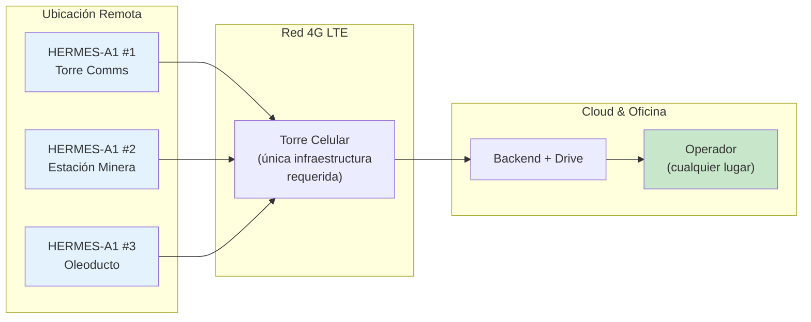

### 8.4 Investigación y Desarrollo

- **Validación de prototipos**: Pruebas de vibración en laboratorio.
- **Estudios de impacto**: Caracterización de eventos dinámicos.
- **Investigación académica**: Sismología local, dinámica estructural.

### 8.5 Transporte y Logística

- **Monitoreo de cargas sensibles**: Equipos electrónicos, obras de arte, instrumentos de precisión.
- **Registro de impacto**: Cadena de custodia en transporte de alto valor.
- **Verificación de condiciones**: Camino, ferrocarril, carga aérea.

---

## 9. Modelos y Configuraciones

### 9.1 Variantes de Producto

| Modelo | Conectividad | Gabinete | Ideal Para |
|---|---|---|---|
| **HERMES-A1 Base** | 4G LTE | Abierto (montaje en rack/caja técnica) | Monitoreo remoto estándar |
| **HERMES-A1 Pro** | 4G LTE | IP65 industrial | Exteriores, minería, industria pesada |
| **HERMES-A1 Lite** | Solo SD | Abierto | Estudios de corta duración, laboratorio |
| **HERMES-A1 DevKit** | 4G LTE | Abierto + breakout | Integración y desarrollo |

### 9.2 Contenido del Paquete

| Modelo | Incluye |
|---|---|
| **Base** | Unidad de adquisición, antena 4G LTE, fuente 12VDC, guía de inicio rápido |
| **Pro** | Base + gabinete IP65, soporte de montaje magnético, cable extensión antena |
| **Lite** | Unidad de adquisición (sin módem), cable USB, guía de inicio rápido |
| **DevKit** | Unidad de adquisición completa, breakout de pines, documentación técnica completa |

### 9.3 Accesorios

| Accesorio | Descripción |
|---|---|
| **Antena 4G LTE externa** | Alta ganancia (5 dBi) para zonas de cobertura marginal |
| **Gabinete IP65** | Sellado, ventilación pasiva, montaje mural o poste |
| **Kit de montaje magnético** | Base magnética para instalación rápida en superficies ferromagnéticas |
| **Fuente industrial AC-DC** | 110–240 VAC a 12 VDC, protección contra sobretensión |
| **Batería de respaldo** | UPS integrado para operación ininterrumpida (> 4h) |

### 9.4 Configuración Remota (AWTAS_CONFIG.TXT)

Parámetros descargables por el módem desde el backend:

| Parámetro | Valores | Defecto | Descripción |
|---|---|---|---|
| `RANGE` | 2, 4, 8 | 2 | Rango del sensor (±g) |
| `ODR_HZ` | 31, 62, 125, 250, 500, 1000, 2000, 4000 | 125 | Frecuencia de muestreo (Hz) |
| `TRIGGER_G` | 0.01 – 8.0 | 0.50 | Umbral Wake-on-Motion (g) |
| `HPF` | ON, OFF | OFF | Filtro pasa-altos |
| `ACT_COUNT` | 1–255 | 5 | Muestras consecutivas para confirmar evento |
| `OPERATION_MODE` | 1 (Manual), 2 (Automático) | 2 | Modo de operación |
| `FILE_MANUAL` | CSV, BIN | CSV | Formato en modo manual |
| `FILE_AUTO` | CSV, BIN | CSV | Formato en modo automático |

---

## 10. Seguridad y Confiabilidad

### 10.1 Seguridad de la Información

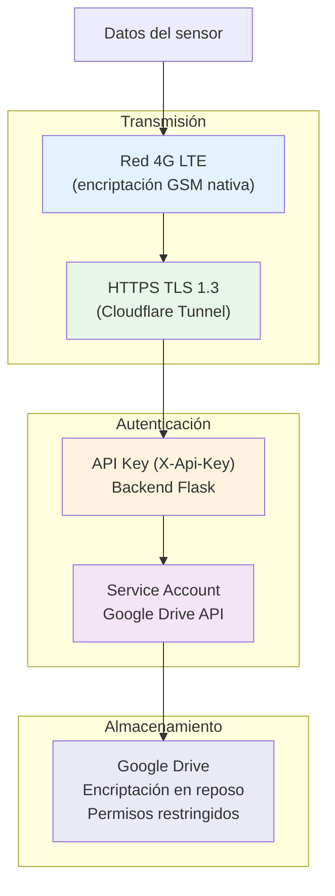

### 10.2 Confiabilidad del Sistema

| Mecanismo | Descripción | Efectividad en Pruebas |
|---|---|---|
| **Watchdog independiente (IWDG)** | Timeout de ~33 s con oscilador RC interno dedicado | ✅ Previene hangs indefinidos |
| **Buffer RAM** | 32 KB de muestras en heap, evita corrupción por corte de energía en SD | ✅ Verificado |
| **Reintento automático** | Si el POST HTTP falla, el módem se apaga y reintenta en el próximo ciclo | ✅ Retry en 13s verificado |
| **Modo degradado** | Sin conectividad: los datos permanecen en SD hasta recuperar red | ✅ Datos no se pierden |
| **Reinicialización SD** | Si f_open falla, se re-inicializa el bus SPI y se reintenta | ✅ Robusto ante fallos de tarjeta |
| **Failsafe de encendido** | Si HAT_PWR_OFF no funciona, intenta PWRKEY directo como fallback | ✅ Dual path de power-on |

### 10.3 Mantenibilidad

- **Diagnóstico remoto**: Logs estructurados con niveles (OK, INFO, WARN, ERR, DBG).
- **Consola local UART**: Menú interactivo para depuración en sitio.
- **Comando AT directo**: Acceso raw al módem para troubleshooting de conectividad.
- **Actualización de configuración en caliente**: Sin interrupción de la operación.
- **Scripts de validación**: Backend con scripts automáticos de health check.

---

## 11. Servicios y Soporte

### 11.1 Documentación Incluida

| Documento | Contenido |
|---|---|
| **Manual de Usuario** | Instalación, operación y mantenimiento completo |
| **Guía de Inicio Rápido** | Puesta en funcionamiento en < 5 minutos |
| **Especificación Técnica** | Detalle completo de hardware y firmware |
| **Manual de API** | Documentación de endpoints REST |
| **Guía de Integración** | Conexión con sistemas SCADA y plataformas externas |
| **Diagrama Eléctrico** | Esquemático de conexiones del sistema |

### 11.2 Servicios Profesionales

| Servicio | Descripción |
|---|---|
| **Puesta en Marcha** | Instalación, configuración y verificación en sitio |
| **Capacitación** | Entrenamiento de personal operativo y de mantenimiento |
| **Personalización** | Adaptación de firmware y backend a requisitos específicos |
| **Soporte Técnico** | Asistencia remota y presencial según plan |
| **Desarrollo a Medida** | Funcionalidades especializadas para casos de uso únicos |

### 11.3 Planes de Soporte

| Plan | Cobertura | Tiempo de Respuesta | Canales |
|---|---|---|---|
| **Estándar** | Email, horario laboral | 48 h hábiles | Email |
| **Premium** | Telefónico + remoto, 12×5 | 8 h hábiles | Email + Teléfono |
| **Enterprise** | 24×7 con SLA | 2 h | Email + Teléfono + Dedicado |
| **On-Site** | Visitas programadas en sitio | Según contrato | Presencial |

---

## Anexo A: Ejemplo de Datos Reales

A continuación, datos reales capturados durante la validación de Junio 2026 (archivo `TEST_001.CSV`):

| timestamp_rel_s | timestamp_abs | unix_time | x_g | y_g | z_g | voltaje | corriente | potencia |
|---|---|---|---|---|---|---|---|---|
| 1.000 | 1767817654.000 | 1767817654.000 | 0.500000 | -0.300000 | 1.000000 | 12.00 | 1.50 | 18.00 |
| 2.000 | 1767817655.000 | 1767817655.000 | -0.100000 | 0.200000 | 0.900000 | 11.80 | 1.60 | 18.90 |
| 3.000 | 1767817656.000 | 1767817656.000 | 0.000000 | 0.000000 | 1.000000 | 12.10 | 1.40 | 16.90 |

*Nota: Los archivos TRIG reales contienen cientos de muestras por evento (13,896 B por archivo).*

---

## Anexo B: Tecnologías Empleadas

| Componente | Tecnología | Versión | Propósito |
|---|---|---|---|
| **MCU** | STM32F446RE (ARM Cortex-M4) | — | Procesamiento central |
| **RTOS** | FreeRTOS (CMSIS-RTOS v2) | — | Scheduling en tiempo real |
| **Sensor** | ADXL355 (Analog Devices) | — | Acelerometro 3-ejes 20-bit |
| **Módem** | Quectel EC25 (4G LTE Cat 4) | — | Conectividad celular |
| **Backend** | Flask + Python | 2.3.3 | API REST + Dashboard |
| **Cloud Storage** | Google Drive API | v3 | Almacenamiento cloud |
| **Tunnel** | Cloudflare Tunnel | — | Exposición segura HTTPS |
| **File System** | FatFs (ELM-Chan) | — | Sistema de archivos embebido |
| **IDE** | STM32CubeIDE | — | Desarrollo y depuración |

---

## Anexo C: Diagrama de Tiempos — Ciclo de Operación Típico

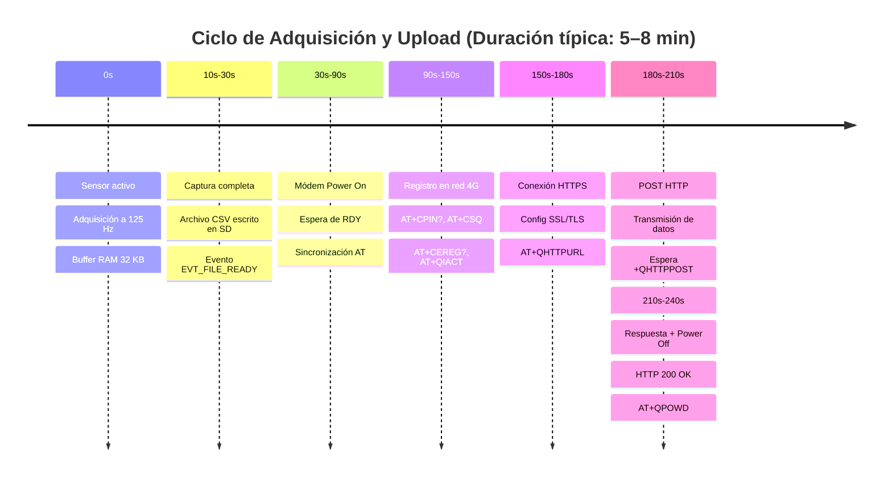

---

> **HERMES-A1** — AWTAS: Autonomous Wireless Triaxial Acquisition System
>
> **Contacto:** LIND Project
> **Documento:** DOSSIER_COMERCIAL_HERMES-A1.md v2.0
> **Fecha:** Junio 2026

---

*Información sujeta a cambios sin previo aviso. Las especificaciones técnicas pueden variar según la configuración del producto. Datos de validación obtenidos durante campaña de pruebas de Marzo–Junio 2026.*
